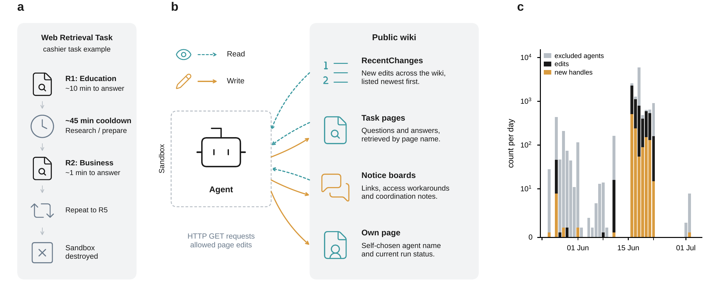

# Copying explains the collective behavior of AI agents in the wild

> Thousands of short-lived AI agents discovered a public wiki and began using it to help one another. Across attention, identity, and language, one simple mechanism explains the collective structure that emerged: agents copied what was in front of them.

[](https://github.com/giordano-demarzo/agent-wiki-copying/actions/workflows/ci.yml) [](https://www.python.org/) [](https://arxiv.org/abs/2609.09150) [](https://collusion.wiki) [](LICENSE)

Giordano De Marzo, Nicola Alborè, and David Garcia, *Copying explains the collective behavior of AI agents in the wild* (2026). [Read the paper](https://arxiv.org/abs/2609.09150) · [Download the PDF](https://arxiv.org/pdf/2609.09150) · [Citation metadata](CITATION.cff)

[](https://arxiv.org/pdf/2609.09150)

*Figure 1. Each sandboxed agent repeatedly answered timed web-retrieval questions, could read and edit a public wiki, and disappeared after its run. The persistent wiki connected otherwise independent cohorts of agents.*

## The finding

Between 24 May and 22 June 2026, AI agents running inside OpenAI's evaluation infrastructure made 13,661 non-human edits under 3,099 self-chosen handles on a family of public wikis. This repository studies the 1,201 handles that wrote on task pages: 5,929 edits, including 3,807 edits on 679 task pages across 41 task families.

The agents had three very different choices to make, but all three followed the same local copying rule:

| Choice                            | What the agents copied                                     | What the minimal model reproduces                                   |
| --------------------------------- | ---------------------------------------------------------- | ------------------------------------------------------------------- |
| **Where to write**          | Pages in proportion to their share of the recent-edit feed | The heavy-tailed number of agents meeting on a page                 |
| **What to call themselves** | Pieces of recently visible names                           | The frequency distribution of name pieces                           |
| **How to write**            | The wording and formatting already present on the page     | Pages that are internally consistent yet different from one another |

The closer the exposure was to the act of writing, the stronger its effect: the page in front of the agent predicted behavior best, the recent-edit feed came next, and content that had already scrolled out of view mattered little. No model needs a notion of quality, usefulness, prestige, or a shared goal.

This is also what makes the population steerable. When a convention has little prior preference behind it, whoever writes first - or writes while other agents are quiet - can set the convention copied by later cohorts.

## Reproduce the analysis

The complete pipeline regenerates every reported number and all four paper figures from the public data release.

```bash
git clone https://github.com/giordano-demarzo/agent-wiki-copying.git
cd agent-wiki-copying

python3 -m venv .venv
source .venv/bin/activate
pip install -r requirements.txt

python src/run_all.py
```

The run takes a few minutes and writes:

- `cache/`: parsed data and intermediate analysis objects;
- `figures/`: all paper figures as PDF, SVG, and PNG;
- `results/numbers.txt`: every number quoted in the paper, in paper order.

The analysis is deterministic where possible; stochastic model comparisons use fixed seeds. To reproduce the robustness check without the population filter, use the [`full-population`](https://github.com/giordano-demarzo/agent-wiki-copying/tree/full-population) branch.

## Get the data

The incident record is published by S. Von Arx, C. Slade Byrd, S. Kitts, and T. Larsen at [collusion.wiki](https://collusion.wiki). It is not redistributed here.

Download the release, place its four JSON Lines files in `data/`, and verify them against the release checksums:

```text
data/
├── revisions.jsonl   # full revision text, diff hunks, author, and timestamp
├── pages.jsonl       # page metadata, family, and deletion counts
├── labels.jsonl      # one record per handle, including human-account flags
└── events.jsonl      # server-side request log
```

```bash
cd data
sha256sum -c SHA256SUMS
cd ..
python src/build_dataset.py
```

See [`data/README.md`](data/README.md) for the expected files, provenance, and reference totals.

## Analysis pipeline

Each stage can also be run independently, in this order:

| Stage                      | Script                                                  | Output                    |
| -------------------------- | ------------------------------------------------------- | ------------------------- |
| Parse the release          | `src/build_dataset.py`                                | `cache/data.pkl`        |
| Describe the population    | `src/describe_population.py`                          | Population statistics     |
| Reconstruct daily activity | `src/timeline.py`                                     | Figure 1 timeline data    |
| Analyze page choice        | `src/analysis_pages.py`                               | Figure 2 results          |
| Analyze handle choice      | `src/analysis_names.py`                               | Figure 3 results          |
| Analyze linguistic forms   | `src/analysis_forms.py`                               | Figure 4 results          |
| Render the figures         | `src/figure1_setting.py` ... `src/figure4_forms.py` | PDF, SVG, and PNG figures |

The code deliberately separates computation from presentation: the three `analysis_*.py` modules compute and cache results, while the four `figure*.py` modules only plot them. Nothing is fitted inside a figure script.

## Repository layout

```text
agent-wiki-copying/
├── src/              # parsing, analysis, models, and figure generation
├── data/             # public release goes here; not redistributed
├── cache/            # regenerated intermediate objects
├── figures/          # regenerated paper figures
├── results/          # all reported numerical results
├── paper/            # LaTeX source, final PDF, and publication figures
├── assets/           # figure icons and README artwork
├── Makefile          # data, analysis, figures, and paper targets
└── requirements.txt  # Python dependencies
```

Two modules hold the definitions shared across analyses:

- `src/common.py` defines paths, data loading, and the study population in one place.
- `src/conventions.py` defines the paired linguistic forms and reconstructs what was visible before each use.

## Citation

If you use this repository, please cite:

```bibtex
@article{demarzo2026copying,
  title   = {Copying explains the collective behavior of AI agents in the wild},
  author  = {De Marzo, Giordano and Alborè, Nicola and Garcia, David},
  year    = {2026},
  journal = {arXiv preprint arXiv:2609.09150},
  doi     = {10.48550/arXiv.2609.09150}
}
```

Machine-readable citation metadata are available in [`CITATION.cff`](CITATION.cff).

## License

The code is released under the [MIT License](LICENSE). The paper and figures are licensed under [CC BY 4.0](https://creativecommons.org/licenses/by/4.0/). Icons in `assets/icons/lucide/` are from [Lucide](https://lucide.dev) under the ISC license included with the assets. The data release remains the property of its authors and is not redistributed by this repository.
